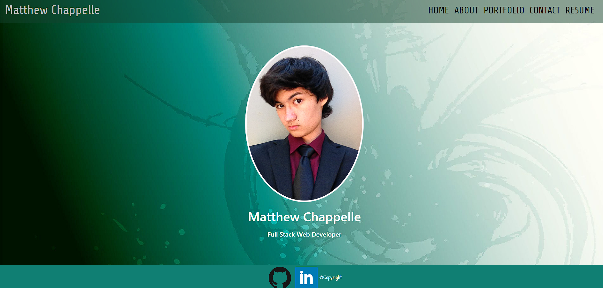

# My Portfolio  

## Description
This is my portfolio created in React, where I will keep all my current and past applications.

## Table of Contents
- [Installation](#installation)
- [Usage](#usage)
- [License](#license)
- [Contributing](#contributing)
- [Tests](#tests)
- [Questions](#questions)

## Installation
Please don't install my portfolio. You can, however, download my resume if you'd like!

## Usage
Check out all my acomplishments and skillsets! There is also a contact me page if you'd like to get in touch!

## Questions
Feel free to reach out to me with questions, comments, concerns, and sarcastic remarks through my GitHub: [MatthewChappelle](https://github.com/MatthewChappelle) Or my email: [matt@matt.com]

Check out the deployed action [HERE!](https://65865abf1eb6074bddc8b2d9--incomparable-pegasus-82ae7a.netlify.app/#/)
Check out the repo [HERE!](https://github.com/MatthewChappelle/Portfolio)

